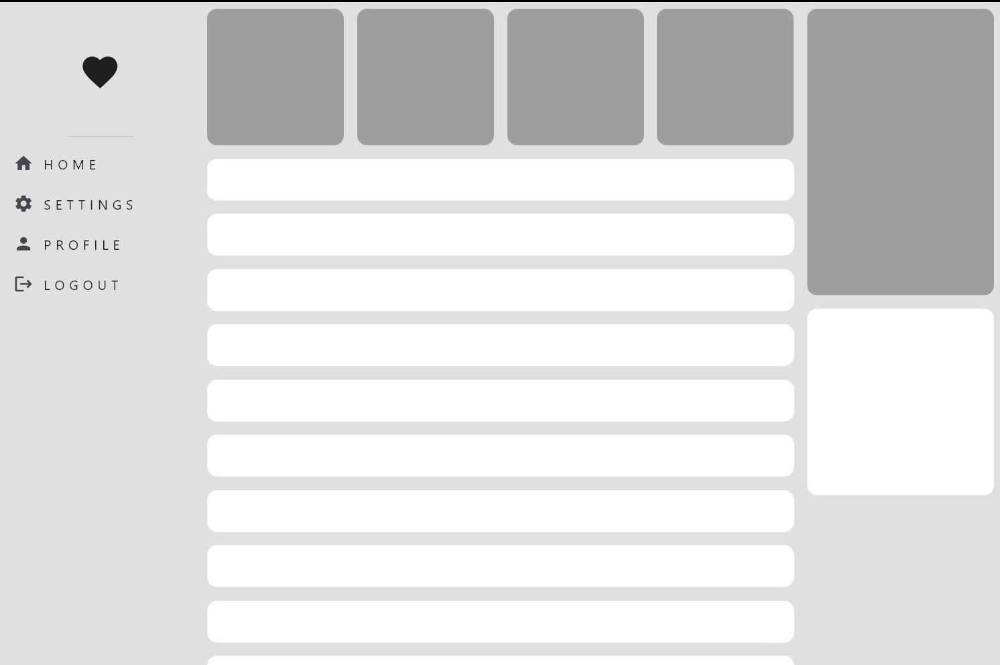
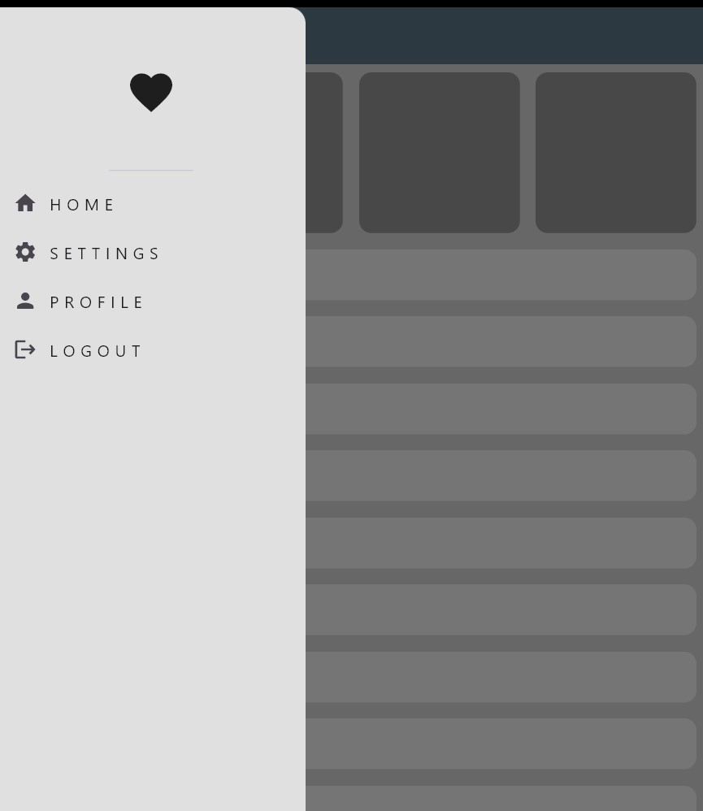
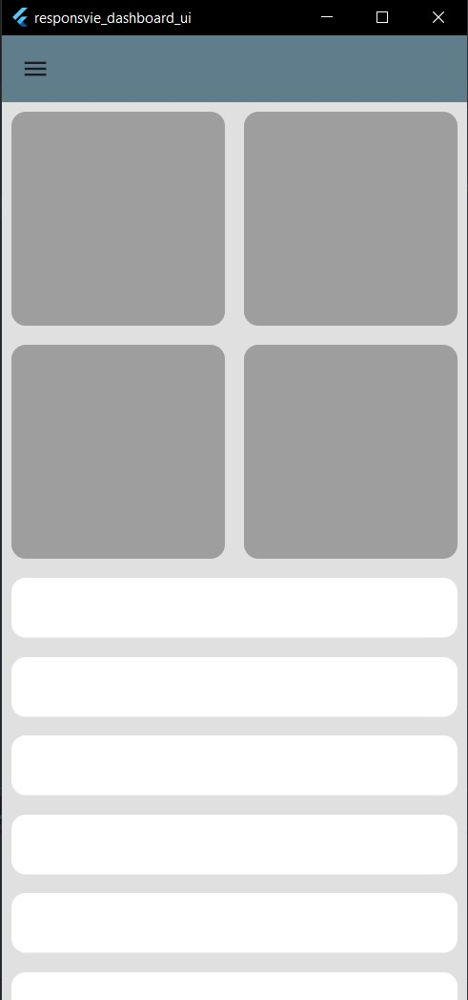
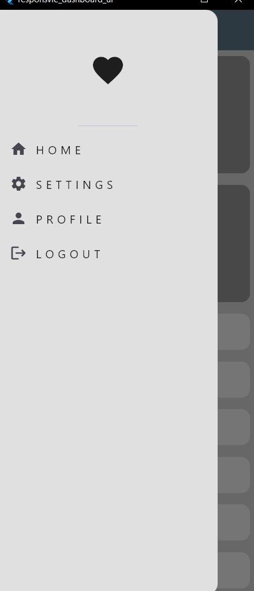
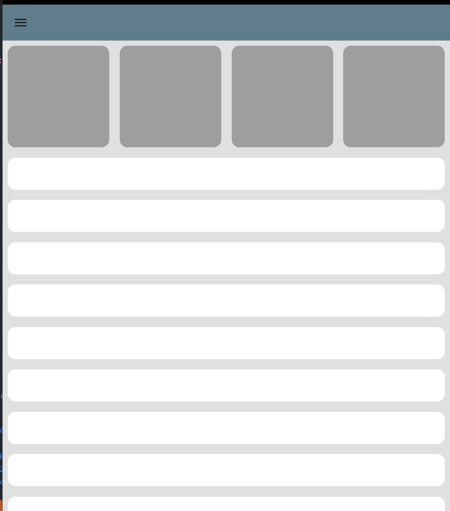

# 📊 Flutter Responsive Dashboard UI  

A modern and responsive **Dashboard UI** built with Flutter.  
This project demonstrates how to design adaptive UIs for **mobile, tablet, and desktop** using Flutter’s layout and responsive design techniques.  

## 🚀 Features  
- Responsive layout (Mobile, Tablet, Desktop)  
- Adaptive widgets and dynamic sizing  
- Clean and structured project architecture  
- Easy to customize and extend  
- Supports both **light & dark themes** (optional)  

## 📱💻🖥️ Screenshots  

### 🖥️ Desktop View  
  

### 🖥️ Desktop View with Drawer  
  

### 📱 Mobile View  
  

### 📱 Mobile View with Drawer  
  

### 📟 Tablet View  
  

## 🛠️ Technologies Used  
- [Flutter](https://flutter.dev/) (latest stable)  
- [Dart](https://dart.dev/)  

## 📂 Project Structure  
